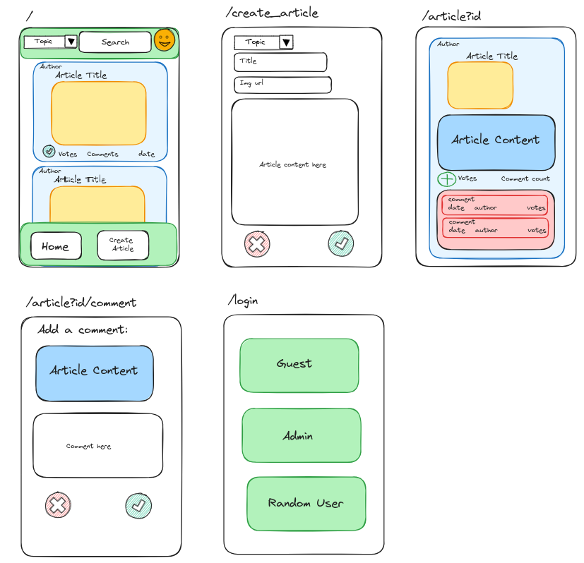
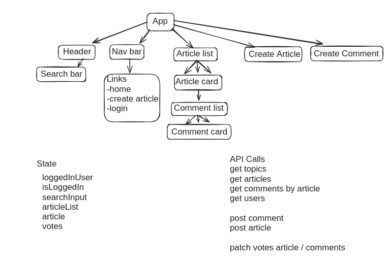

"endpoints": {
"GET /api": {},
"GET /api/topics": {},
"GET /api/articles": {},
"queries": [
"sort_by",
"order",
"limit",
"p"
],
"GET /api/articles/:article_id": {},
"GET /api/articles/:article_id/comments": {},
"POST /api/articles/:article_id/comments": {},
"POST /api/topics": {},
"GET /api/users": {},
"GET /api/users/:username": {},
"PATCH /api/articles/:article_id": {},
"PATCH /api/comments/:comment_id": {},
"DELETE /api/comments/:comment_id": {},
"DELETE /api/articles/:article_id": {}
}
